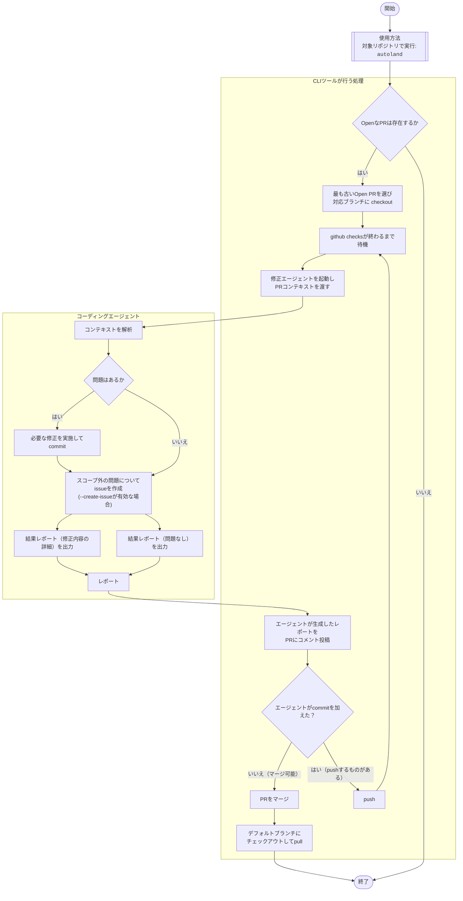

# Autoland

バイブコーディングでPR作成後の修正・マージワークフローを自動化するCLIツール

## 概要

Autolandは、プルリクエストのレビュー後ワークフローを完全自動化します。CodeRabbitやClaude Code ReviewなどのAIレビューツールをCIに組み込んでおくと、レビュー完了後に指摘内容を自動で修正し、マージまで実行します。

## 主な機能

- 自動修正: CodexやClaude Codeを使用してレビュー指摘を自動修正
- 自動マージ: 修正完了後、自動的にマージを実行
- OpenなPRの自動検出と処理
- GitHub checksの完了待機
- 修正内容の自動コミット・プッシュ
- マージ可否の自動判定とマージ実行
- 2つの動作モード:
  - 単発モード: 1つのPRのみを処理
  - Watchモード: 継続的に新しいPRを監視・処理

## 前提条件

- CIで何らかのAIコードレビューツール（CodeRabbit、Claude Code Reviewなど）が実行されていること
- バイブコーディングでの使用を想定した設計
- `gh` (GitHub CLI)
- `claude` または `codex` コマンドが設定済みであること
- Gitリポジトリでの実行

## 注意事項

- 本ツール自体にはコードレビュー機能は含まれていません。外部のCIレビューツールと組み合わせて使用してください
- 無償公開版にはコード品質向上機能は含まれていません
- コード品質向上機能が必要な場合は、今後リリース予定の商用版をご利用ください

## インストール

```bash
pipx install autoland
```

pipxについては <https://pipx.pypa.io/latest/installation/> を参考にしてください。


## 使用方法

対象リポジトリのディレクトリで実行：

```bash
autoland
```

## 動作フロー

1. **PR検出**: 最も古いOpenなPRを選択し、対応ブランチにcheckout
2. **Checks待機**: GitHub checksの完了を待機
3. **自動修正**: AIエージェントがレビューコメントを解析し、必要な修正を実行
4. **変更プッシュ**: 修正をコミットし、処理レポートをコメント投稿
5. **再チェック**: 新しいコメントの確認と再修正
6. **マージ実行**: 問題がなければ自動マージ
7. **main同期**: デフォルトブランチ（例: `main`）にチェックアウトして最新をpull



## 設計方針

- CLIは認証情報を管理せず、既存ツールを活用
- 複雑な判定はAIに委譲し、機械的な判定のみCLI側で実装
- 長時間実行のためタイムスタンプ付きログ出力
